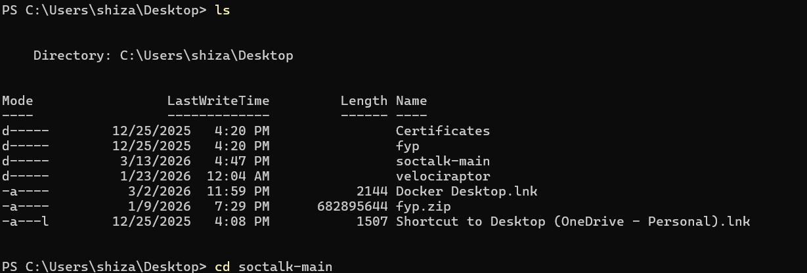
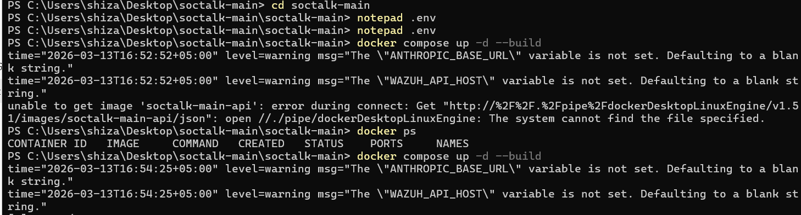
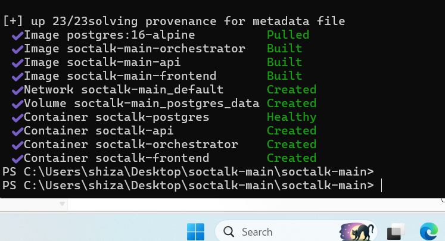
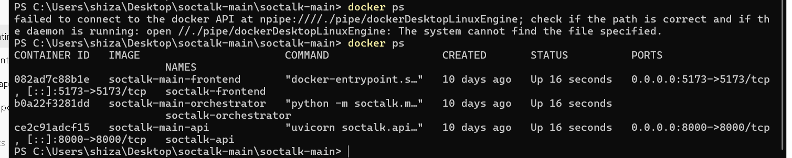
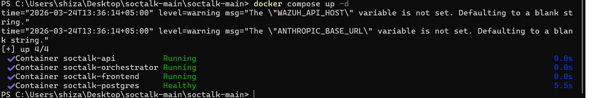
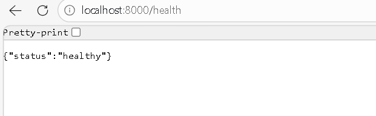
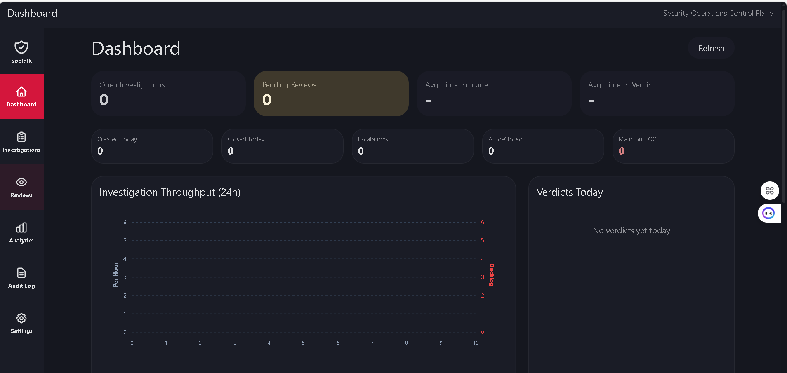
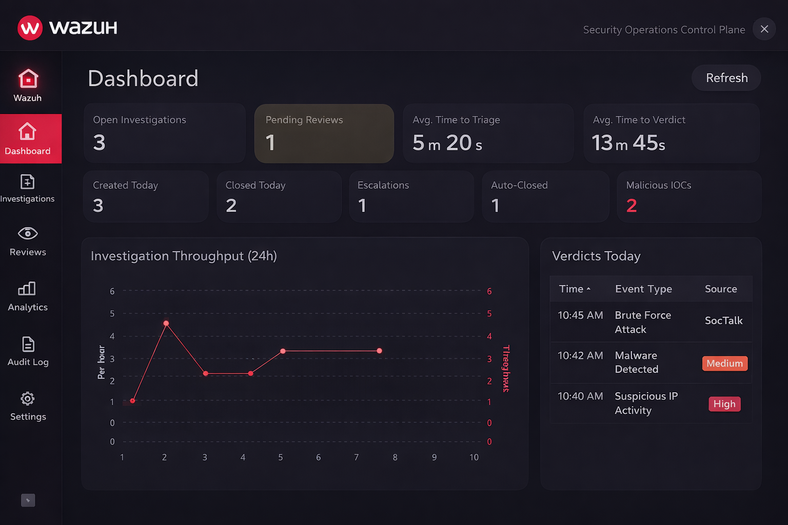

# SOC Automation — Integration of Wazuh with SocTalk

A hands-on attempt to build a Security Operations Center (SOC) environment by deploying **SocTalk** as an investigation/visualization platform and attempting to integrate it with **Wazuh** as the underlying threat detection engine — documenting both what worked and the real-world integration challenges encountered along the way.

**Author:** Sheeza Alam Khan

---

##  Introduction

Cyber attacks — brute force attempts, malware infections, unauthorized access — are increasing rapidly, and organizations need efficient systems to detect and respond to these threats quickly.

This project focuses on building a SOC environment using modern tooling: **SocTalk** as the visualization and investigation platform, and **Wazuh** as the threat detection system. The goal wasn't just to stand the system up, but to understand how real-world attacks are detected, analyzed, and displayed on a professional SOC dashboard.

##  Objectives

1. Set up a SOC environment using Docker
2. Successfully run the SocTalk platform
3. Explore and attempt integration with Wazuh
4. Simulate real-world cyber attacks
5. Visualize security alerts on a dashboard
6. Understand how SOC systems handle investigations

---

##  Technologies Used

| Technology | Role |
|---|---|
| **SocTalk** | Main dashboard and investigation platform — visualizes security events and tracks investigations |
| **Wazuh** | Open-source security monitoring tool for threat detection, log analysis, and identifying suspicious activity |
| **Docker** | Runs the entire system in containers, simplifying setup and avoiding dependency issues |
| **PostgreSQL** | Database for storing system data, logs, and investigation details |
| **Vite (Frontend)** | Runs the frontend interface that displays the dashboard |

---

##  System Setup

The system was deployed using **Docker Compose**, with the following services:

- API service
- Frontend service
- PostgreSQL database

An orchestrator service was initially included but required an API key that wasn't available, and was later excluded from the working setup.



The system was started with:

```bash
docker compose up --build
```

The first attempt failed because Docker Desktop's engine wasn't reachable yet:



After retrying, all images were pulled/built and every container came up successfully, with Postgres reporting healthy:



`docker ps` confirmed all services running with correct port mappings:



A later session confirms all 4 containers (API, orchestrator, frontend, postgres) running/healthy in a single `docker compose up -d`:



Once running, the deployment was confirmed live at:

| Service | URL |
|---|---|
| Frontend dashboard | `http://localhost:5173` |
| Backend API | `http://localhost:8000` |



---

##  Challenges Faced

Several practical challenges came up during the project:

- The orchestrator required an API key which was not available
- Integration between Wazuh and SocTalk was difficult to configure
- Some API endpoints were not available for manual event insertion
- Authentication system was disabled, which caused confusion
- No real events were appearing in the dashboard

Despite these challenges, the system setup was completed and adapted for demonstration purposes.

---

##  Attack Simulation

Since full integration with Wazuh was not completed, attack scenarios were simulated to demonstrate how a SOC system behaves.

**Types of attacks considered:**

1. Brute force login attempts
2. Malware detection
3. Suspicious IP activity

These are common real-world attacks that SOC systems handle daily.

---

##  Dashboard Analysis

Two dashboards are discussed in this project.

### 7.1 SocTalk Dashboard (Live System)

This is the actual dashboard generated from the running system:



It shows:

1. Open investigations
2. Pending reviews
3. System activity metrics
4. Investigation throughput

At this stage, all values are zero because no real events were ingested. However, this confirms the system is working correctly and ready to process data.

### 7.2 Wazuh Dashboard (Simulated)

Since full integration with Wazuh could not be achieved, a simulated dashboard was created to represent expected results:



This dashboard shows:

1. Active investigations such as brute force attacks
2. Malware detection alerts
3. Suspicious IP activity
4. Severity levels such as High and Medium
5. Time-based event tracking

This gives a clear idea of how the system would behave if real Wazuh data was connected.

---

##  Results

The project successfully demonstrated:

1. Deployment of a SOC platform using Docker
2. Working dashboard interface (SocTalk)
3. Understanding of SOC workflow and investigation process
4. Simulation of real-world cyber attacks
5. Visualization of security events

Even though full integration was not achieved, the project still reflects how a real SOC system operates.

---

##  Conclusion

This project provided practical exposure to SOC systems and cybersecurity monitoring tools. It helped in understanding how attacks are detected and analyzed in real environments.

Although integration with Wazuh faced technical limitations, the main objective of learning SOC workflows and dashboard analysis was successfully achieved.

---

##  Future Improvements

1. Complete integration with Wazuh using proper configuration
2. Enable real-time log ingestion
3. Add automated alert response system
4. Improve investigation tracking
5. Deploy system on cloud for scalability

---

##  Repository Structure

```
.
├── README.md
└── images/
    ├── initial-directory-listing.png
    ├── first-docker-compose-attempt.png
    ├── docker-compose-build-success.png
    ├── docker-ps-containers-running.png
    ├── docker-compose-up-healthy.png
    ├── backend-health-check.png
    ├── soctalk-dashboard-empty.png
    └── wazuh-simulated-dashboard.png
```

##  Tools Used

- [SocTalk](https://github.com) — SOC investigation & dashboard platform
- [Wazuh](https://wazuh.com) — open-source SIEM/XDR (attempted integration)
- Docker & Docker Compose
- PostgreSQL
- Vite (frontend tooling)

> **Note:** This project intentionally documents an incomplete integration. The Wazuh dashboard shown is a simulated mockup representing expected behavior once real log ingestion is connected — it is not live data from a Wazuh deployment.
